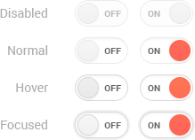

# Switch Overview

The Kendo UI Switch is a component that lets the user toggle between checked and unchecked states.

The Switch is part of the Inputs `npm` package of the Kendo UI suite for React.

**Figure 1: A template of the Switch for React**



## Demos

### Default Setup

The example below demonstrates the default setup of a Kendo UI Switch for React.

```html-preview
  <div id="app"></div>
```
```jsx
  class SwitchComponent extends React.Component {
      constructor(props) {
          super(props);
          this.state = {
              checked: false
          };
      }
      onChange = (e) => {
          this.setState({
              checked: e.checked
          });
      };
      render() {
          return (
              <KendoReactInputs.Switch
                  checked={this.state.checked}
                  onChange={this.onChange}
              />
          );
      }
  }
  ReactDOM.render(
      <SwitchComponent />,
      document.getElementById('app')
  );
```

## Configuration

### Checked

The Switch allows you to set its initial value, so that each subsequent click moves the handle over the newly-selected state.

```html-preview
  <div id="app"></div>
```
```jsx
    class SwitchContainer extends React.Component {
        constructor(props) {
            super(props);
            this.state = {
                checked: true
            };
        }
        onChange = (e) => {
            this.setState({
                checked: e.checked
            });
        };
        render() {
            return (
                <KendoReactInputs.Switch
                    checked={this.state.checked}
                    onChange={this.onChange}
                />
            );
        }
    }
    ReactDOM.render(
        <SwitchContainer />,
        document.getElementById('app')
    );
```

### Labels

The Switch allows you to control the title of the labels by using the [`onLabel`](#onlabel-stringdefault-decrease) and [`offLabel`](#offlabel-stringdefault-increase) properties, which accept `string` parameters. Note that the Switch component does not support long custom labels.

```html-preview
  <div id="app"></div>
```
```jsx
    class SwitchContainer extends React.Component {
        constructor(props) {
            super(props);
            this.state = {
                checked: false,
                onLabel: 'ON',
                offLabel: 'OFF'
            };
        }
        onChange = (e) => {
            this.setState({
                checked: e.checked
            });
        };
        render() {
            return (
                <KendoReactInputs.Switch
                    checked={this.state.checked}
                    offLabel={this.state.offLabel}
                    onChange={this.onChange}
                    onLabel={this.state.onLabel}
                />
            );
        }
    }
    ReactDOM.render(
        <SwitchContainer />,
        document.getElementById('app')
    );
```

### Events

The Switch is designed as a stateless component. To store its state and configuration properties, wrap it in a high-order component.

The [`onChange`](#onchange-function) event fires each time a user interacts with the Switch. The new value is passed as an argument to the `onChange` callback.

```html
  <div id="app"></div>
```
```jsx
    class SwitchContainer extends React.Component {
        constructor(props) {
            super(props);
            this.state = {
                checked: true
            };
        }
        onChange = (e) => {
            this.setState({
                checked: e.checked
            });
        };
        render() {
            return (
                <KendoReactInputs.Switch
                    checked={this.state.checked}
                    onChange={this.onChange}
                />
            );
        }
    }
    ReactDOM.render(
        <SwitchContainer />,
        document.getElementById('app')
    );
```

### Features

The Switch allows you to prevent user interaction with the component. By default, the Switch is enabled and the [`disabled`](#disabled-booleandefault-false) property is set to `false`.

```html-preview
  <div id="app"></div>
```
```jsx
    class SwitchContainer extends React.Component {
        constructor(props) {
            super(props);
            this.state = {
                checked: false,
                disabled: true
            };
        }
        onChange = (e) => {
            this.setState({
                checked: e.checked
            });
        };
        render() {
            return (
                <KendoReactInputs.Switch
                    checked={this.state.checked}
                    disabled={this.state.disabled}
                    onChange={this.onChange}
                />
            );
        }
    }
    ReactDOM.render(
        <SwitchContainer />,
        document.getElementById('app')
    );
```

For detailed information on the Kendo UI Switch for React configuration, refer to its [client-side API documentation]().

## Keyboard Navigation

Below is the list with the keyboard shortcuts the Switch supports.

| SHORTCUT                            | DESCRIPTION         |
|:---                                 |:---                 |
| `Space` key  | Toggle the component checked state. |

## Accessibility

To be accessible, many radio or checkbox components usually require a fieldset and legend elements, or a WAI ARIA substitute. In the case of the Switch component this is unnecessary, because the labels are clear.

## Suggested Links

* [API Reference of the Switch Component]()
